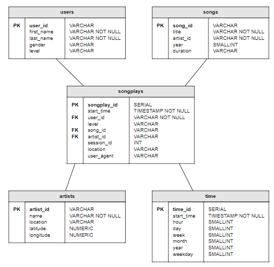

# Sparkify On A Data Lake

## Overview

This program will do an ETL of Sparkify dat extracting song and log data from an S3 bucket, then process it using Spark and finally store the result data back as dimensional tables back on S3. 

This program satifies requirements of the Udacity Data Engineering Nanodegree program for Data Warehouse Project #4.


## Prequisites

1. Make sure the raw data files are properly located in S3 bucket with path `s3://udacity-dend/`.
2. The configuration file contains an AWS key & secret. The key & secret must come from an admin user that was set up with _programmatic access_ enabled.
3. The files `etl.py` & `dl.cfg` are in the same diectory.

## How to run

1. Run the python script `etl.py` from terminal.

## Expected output is

The analytical retults are stored in the same S3 bucket in a directory called `analytics`.  THere will be a sub-directory for each dimensional table of `artists`, `songplays`, `songs`, `time` & `users`.  The tables are stored in parquet columnar format. (see Database Schema for more info.)


---

## Configuration file

A file named `dl.cfg` must contain these entries (do not use quotes around the values):

```
[AWS]
AWS_ACCESS_KEY_ID = {your_aws_key}
AWS_SECRET_ACCESS_KEY = {your_aws_secret}
```


---

## Raw Data

Files must be stored in `s3://udacity-dend/` bucket.


### Song Files
- Must be located in `data/song_data` directory.  They can be optionally be organized in subfolders under that (e.g. data/song_data/A/B/C)
- Must be JSON formatted and contain at least the following keys: song_id, title, artist_id, year, duration, artist_id, artist_name, artist_location, artist_latitude, artist_longitude


### Log files
- Must be located in `data/log_data` directory.  They can be optionally be organized in subfolders under that (e.g. data/log_data/A/B/C)
- Must be JSON formatted and contain at least the following keys: userId, firstName, lastName, gender, level, ts (timestamp in milliseconds), page, sessionId, location, userAgent, artist, song


## Database Schema

Tables are organized into a star schema with **songplays** as the fact table at the center and dimension tables **users, songs, artists,** and **time** surrounding that.

- **songplays**: records in log data associated with song plays i.e. records with page NextSong
    - songplay_id, start_time, user_id, level, song_id, artist_id, session_id, location, user_agent
- **songs**: songs in music database
    - song_id, title, artist_id, year, duration
- **artists**: artists in music database
    - artist_id, name, location, latitude, longitude
- **users**: users in the app
    - user_id, first_name, last_name, gender, level
- **time**: timestamps of records in **songplays** broken down into specific units
    - start_time, hour, day, week, month, year, weekday



